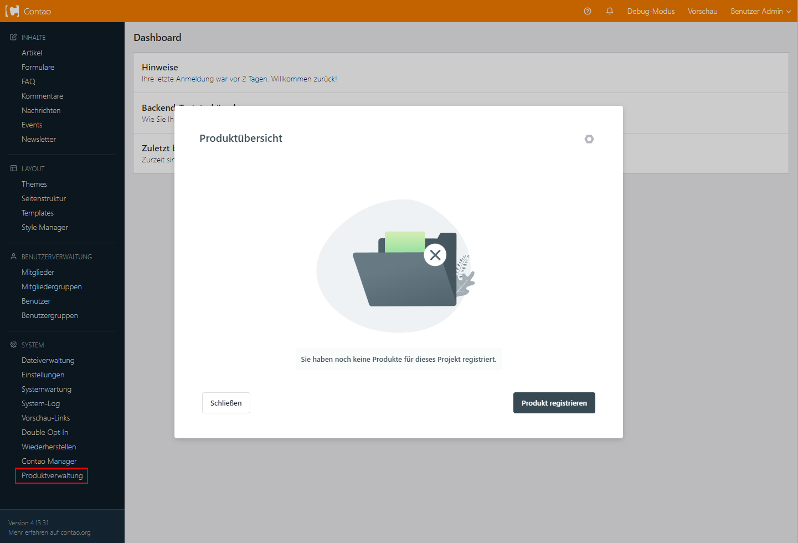
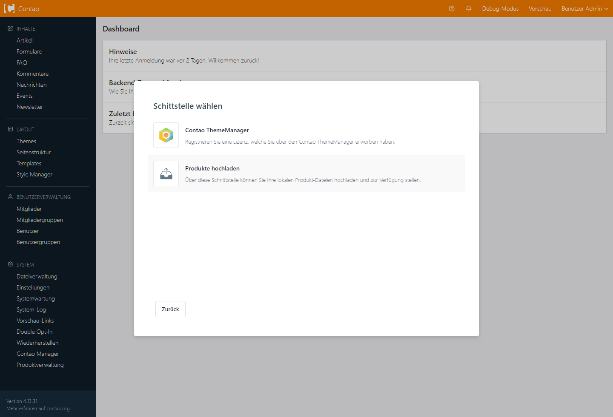
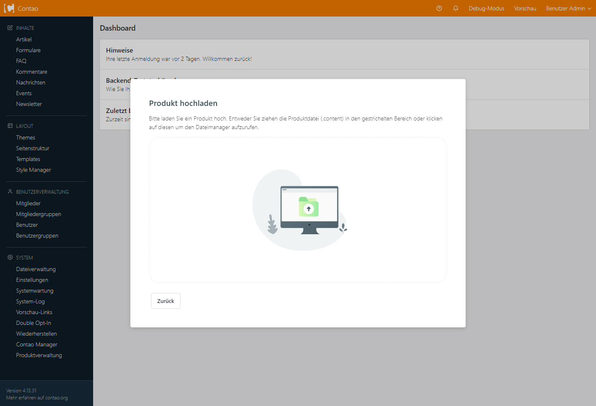
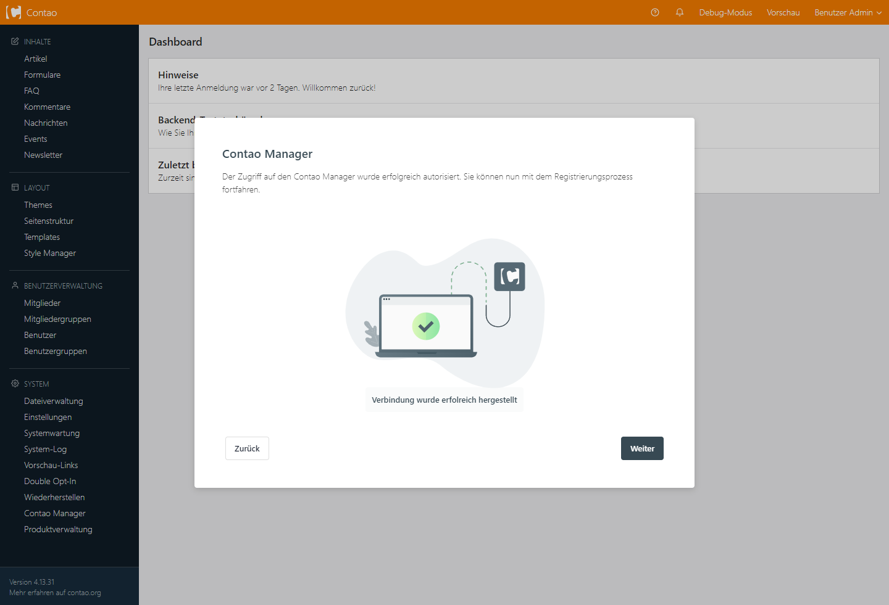
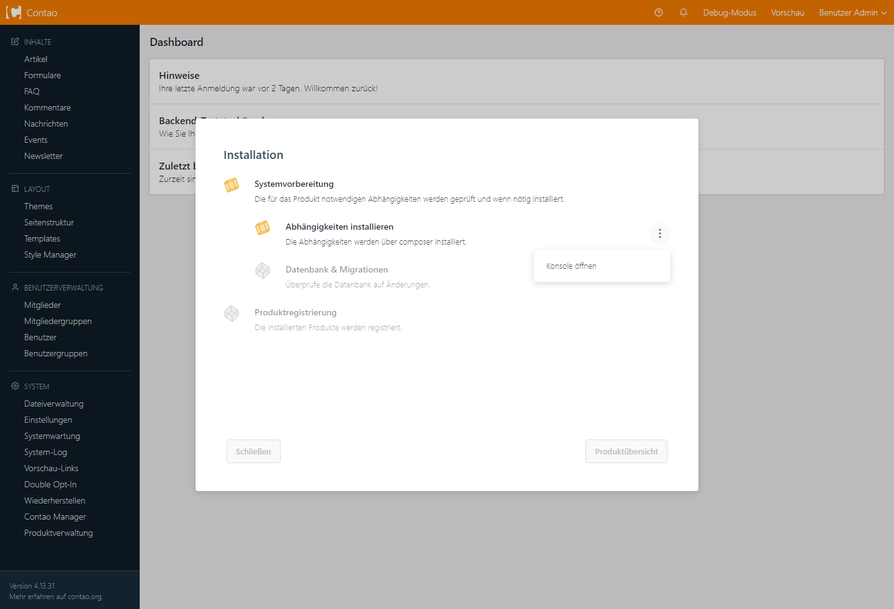
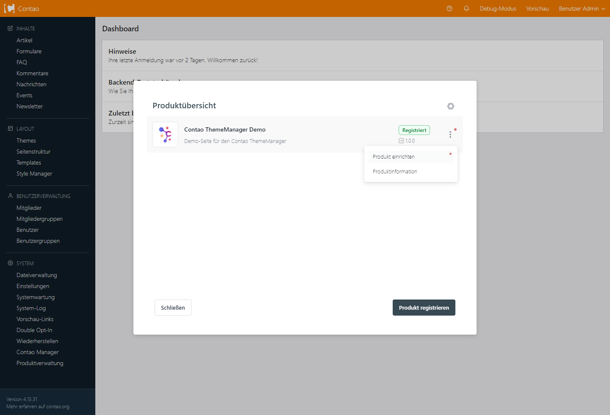
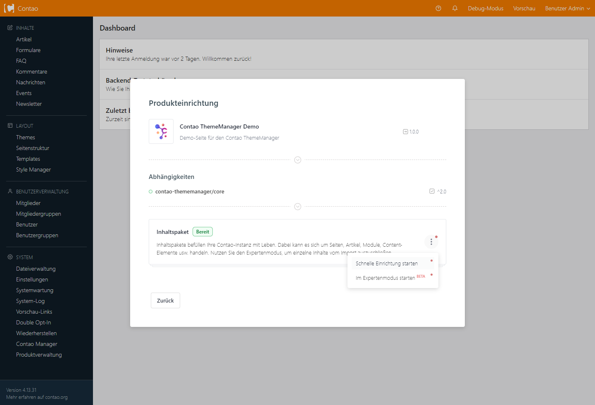

# Installation der Contao ThemeManager Demo

Um einen guten Einblick in die Basiseinstellungen des Contao ThemeManagers zu erhalten, bietet sich oft der Blick in die Demo an. Um die Installation so einfach wie möglich zu gestalten, wird diese über den _Product Installer_ bereitgestellt. Hierbei empfehlen wir die Installation in einer frischen Contao-Instanz. 

## 1. Product Installer installieren

!> Für die Installation über die Kommandozeile muss [Composer](https://getcomposer.org/) auf dem System installiert sein.

#### Composer
```shell
composer require oveleon/contao-theme-manager-bridge 1.0
```

#### Contao Manager
Im Contao Manager steht der _Product Installer_ für den Contao ThemeManager unter dem Namen `ThemeManager: Product Installer` zur Verfügung.

?> Hier findest Du [eine Anleitung, wie Erweiterungen über den Contao Manager installiert](https://docs.contao.org/manual/de/installation/erweiterungen-installieren/) werden können

## 2. Demo herunterladen
Hier findest Du eine Liste der letzten Demo-Versionen. Klicke auf die Version, die Du installieren möchtest, sowie zu Deiner Contao-Version passt und lade das entsprechende Paket herunter.

?> Produkte, welche sich über den _Product Installer_ installieren lassen, enden immer mit `.content`

| Demo Version | Contao Version         |                                          Download                                           |
|--------------|------------------------|:-------------------------------------------------------------------------------------------:|
| `1.0.0`      | `>= 4.13` \| `<= 5.2`  | [💾](https://www.contao-thememanager.com/files/demo/contao-thememanager-demo-1.0.0.content) |


## 3. Demo installieren und einrichten
Sofern der _Product Installer_ installiert und die Demo heruntergeladen ist, können wir mit der Einrichtung dieser beginnen. Im Contao-Backend erscheint nun der Punkt "Produktverwaltung", welcher bei Klick den _Product Installer_ öffnet.



#### Produkt registrieren
Im nächsten Schritt möchten wir die Demo registrieren, damit die Einrichtung über den _Product Installer_ zur Verfügung gestellt wird.  

Mit Klick auf **Produkt registrieren** öffnet sich eine Maske, in der ein bis mehrere Schnittstellen zur Verfügung gestellt werden. Da wir die Demo als lokale content-Datei vorliegen haben, können wir diese direkt über die Schnittstelle "Produkte hochladen" registrieren.

?> Sollten keine weiteren Schnittstellen installiert sein, kann es sein, dass Du bei Klick auf **Produkt registrieren**, direkt in die "Produkt hochladen" Maske geleitet wirst.



#### Produkt hochladen
Die Schnittstelle "Produkte hochladen" bietet Dir eine Uploadmöglichkeit lokaler Produktpakete. Hier kannst Du die Produktdatei (`.content`) der Demo bequem in die gestrichelte Linie ziehen oder per Klick auf das Upload-Symbol zur Verfügung stellen. 
Anschließend wird die Produktdatei vom _Product Installer_ geprüft und angezeigt.



#### Produktprüfung
Hat alles funktioniert sehen wir im nächsten Schritt das soeben hochgeladene Produkt.

?> Es könnte sein, dass Du eine Fehlermeldung bekommst, mit dem Hinweis, dass Deine Contao-Version nicht für das Produkt geeignet ist. Bitte überprüfe in diesem Fall Deine Contao-Version, sowie die Version der heruntergeladenen Demo.


#### Contao Manager Authentifizierung
In der nächsten Maske prüft der _Product Installer_, ob er eine Verbindung zum Contao Manager herstellen kann. Diese wird benötigt, um das Produkt ordnungsgemäß zu installieren.
In diesem Schritt könnten drei Szenarien auftreten. Bitte folgen Sie den Hinweisen des _Product Installers_, um Dein Projekt im Contao Manager zu authentifizieren.

|    |  Installiert  | Authentifiziert | Beschreibung                                       |
|----|:-------------:|:---------------:|:---------------------------------------------------|
| 🟢 |       ✔       |        ✔        | Der Contao-Manager ist einsatzbereit und verbunden |
| 🟡 |       ✔       |        ✕        | Die Authentifizierung ist ausstehend               |
| 🔴 |       ✕       |        ✕        | Der Contao-Manager ist nicht installiert           |

!> Seit der Contao Manager Version `1.7.0` muss das Projekt eine valide SSL-Verbindung aufweisen, um die Authentifizierungen durchzuführen.

Sofern die Verbindung hergestellt wurde, siehst Du folgende Maske:



#### Produktvorbereitung und -registrierung
Nach Klick auf **Weiter** kommen wir in die eigentliche Produktregistrierung und Installation der Abhängigkeiten. Hier erhältst du eine Übersicht der Prozesse, welche durchgeführt werden müssen, um Dein Produkt zu registrieren und anschließend einrichten zu können.
Mit einem weiteren Klick auf **Starten** wird dieser Prozess gestartet.

?> **Tipp:** Über die drei Punkte ( **⋮** ) neben einem Prozess können Details zu diesem aufgerufen oder Aktionen angewendet werden.



!> Sollten Probleme während der Datenbankmigrierung auftreten, kann dieser Schritt übersprungen werden. Bitte führe das Migrieren der Datenbank anschließend über den Contao Manager durch.

#### Produkteinrichtung
Sofern alle Prozesse erfolgreich durchgelaufen sind, steht das Produkt, in diesem Fall unsere Demo, in der Produktübersicht des _Product Installers_ bereit und wartet auf die Einrichtung. 
Über das Menü ( **⋮** ) können Sie Informationen des Produktes einsehen, sowie die Einrichtung dessen starten.

?> Ein registriertes Produkt kann mehrfach in Deiner Contao Instanz eingerichtet werden.



In der Einrichtungsmaske eines Produktes wird zunächst noch einmal geprüft, ob alle Abhängigkeiten installiert und auf dem neusten Stand sind. Sollte dies der Fall sein, kannst du die Einrichtung über das Menü ( **⋮** ) des hier verankerte Inhaltspaketes starten. 

?> Ein Produkt kann mehrere Inhaltspakete oder auch andere Aufgaben beinhalten, welche sich separat einrichten lassen.

!> Wir empfehlen vorerst stets die **schnelle Einrichtung** zu verwenden!



Sobald die Einrichtung abgeschlossen ist, ist die Demo installiert. Schließen Sie den _Product Installer_ und öffnen Sie die Live-Vorschau über das Contao Backend.
