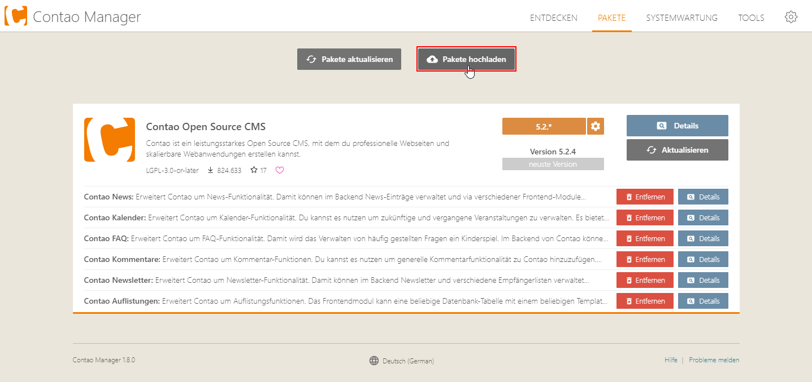
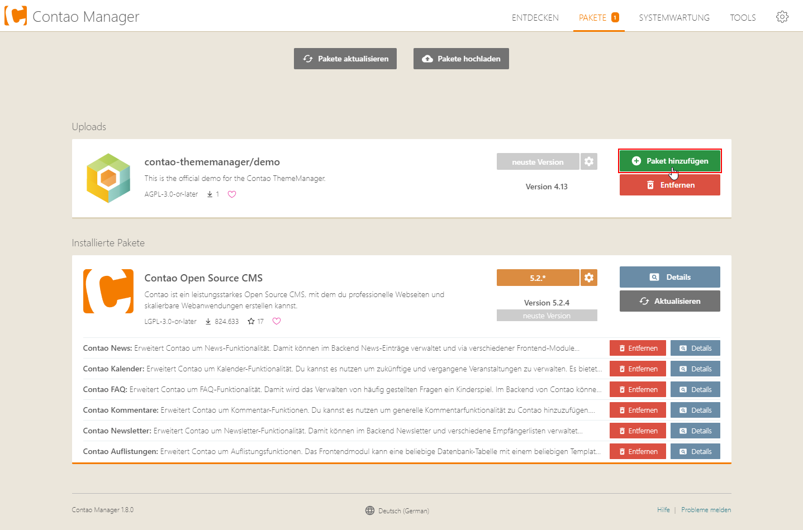
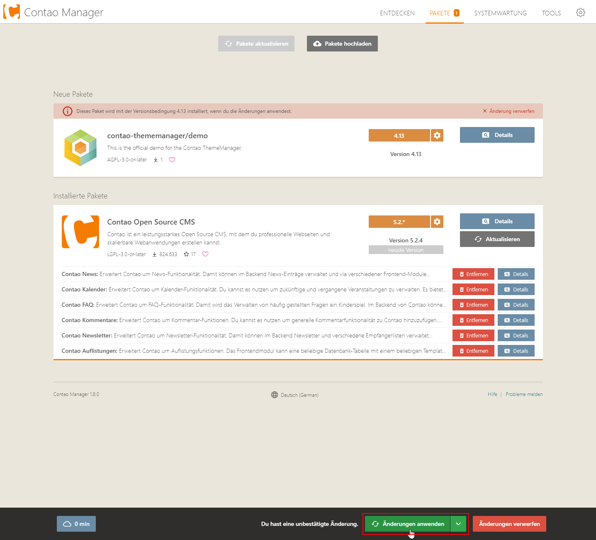

# Demo als Artefakt über den Contao Manager installieren

## 1. Contao Manager installieren
Hier findest Du [eine Anleitung, wie Erweiterungen über den Contao Manager installiert](https://docs.contao.org/manual/de/installation/erweiterungen-installieren/) werden können.

## 2. Demo herunterladen
Hier findest Du eine Liste der letzten Demo-Versionen. Klicke auf die Version, die Du installieren möchtest, sowie zu Deiner Contao-Version passt und lade das entsprechende Paket herunter.

[Downloads](demo-download-list.md ':include')

## 3. Artefakt installieren

Sofern wir eine Artefakt-Datei vorliegen haben, können wir diese ganz einfach per Drag & Drop in den Contao Manager ziehen oder über den Button _Pakete hochladen_ bereitstellen.

Anschließend prüft der Contao Manager das hochgeladene Paket und fragt bei Erfolg, ob diese Paket hinzugefügt werden soll.

Bei Klick auf _Paket hinzufügen_ wird die Demo für das Projekt bereitgestellt und kann anschließend über den Button _Änderungen anwenden_ installiert werden.

