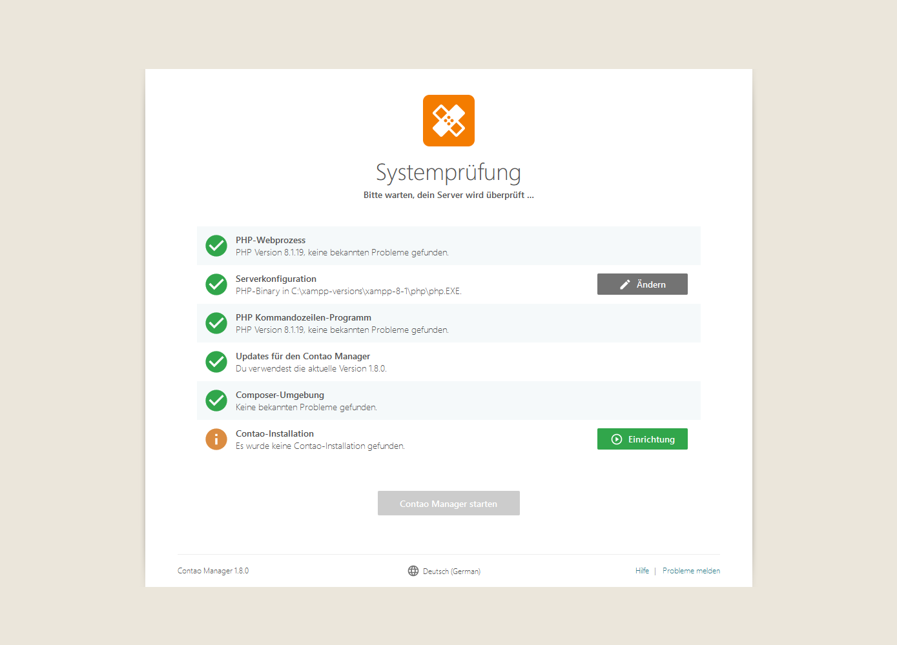
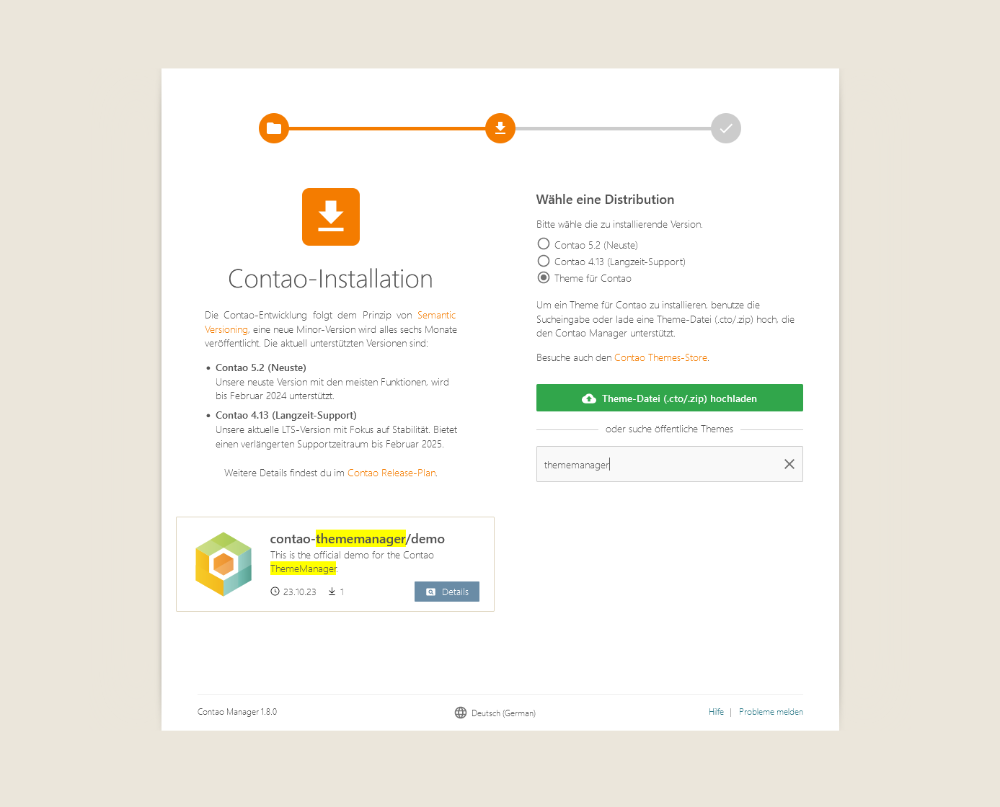
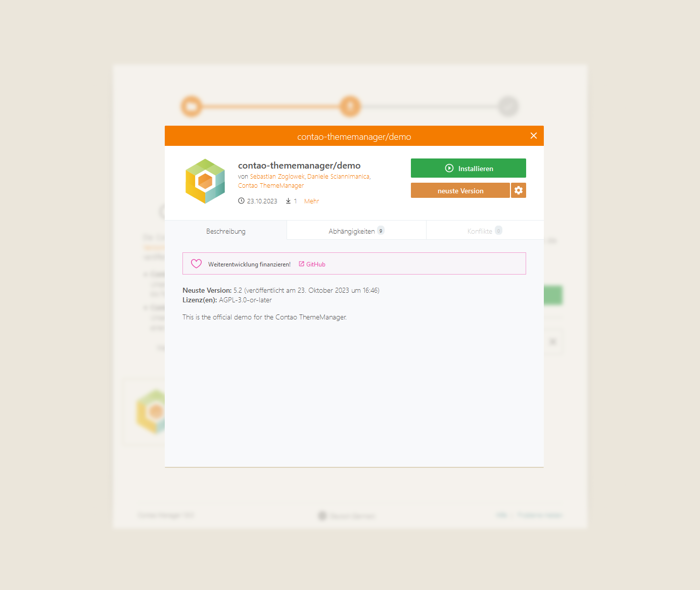
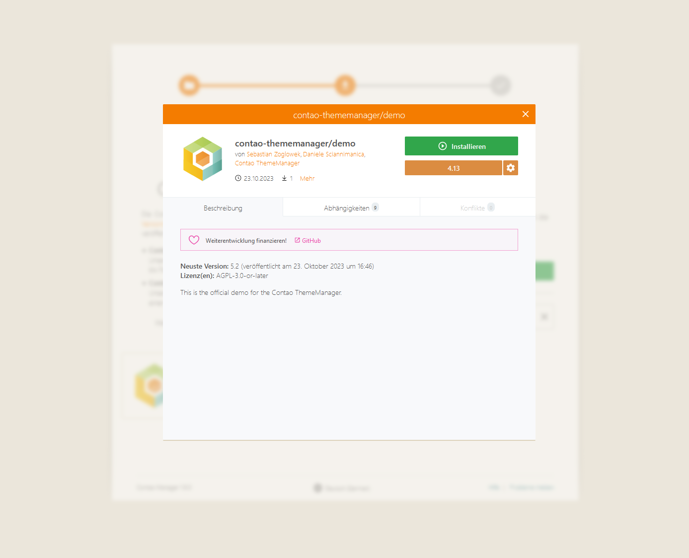
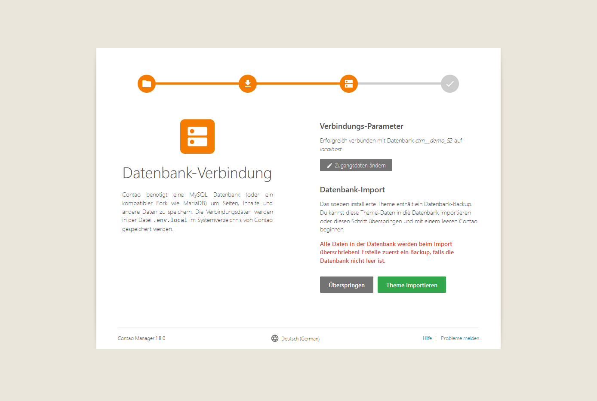

# Demo als Theme über den Contao Manager installieren

## 1. Contao Manager installieren
Hier findest Du [eine Anleitung, wie Erweiterungen über den Contao Manager installiert](https://docs.contao.org/manual/de/installation/erweiterungen-installieren/) werden können.

## 2. Theme installieren
Sofern wir den Contao Manager installiert haben und aufrufen, bekommen wir folgende Maske angezeigt, mit der Aufforderung Contao einzurichten.

Bei Klick auf _Einrichtung_ haben wir die Möglichkeit, Contao für unser Projekt einzurichten. Folge den weiteren Schritten des Contao Managers bis die Wahl der Distribution zur Verfügung steht.

Mit der Version `1.8.0` des Contao Managers stellt dieser eine Möglichkeit zur Verfügung, die Einrichtung direkt mit einem Theme durchzuführen.
Dafür müssen wir die Option _Theme für Contao_ wählen und haben anschließend die Möglichkeit, über das Suchfenster ein Theme zu suchen. Über dem Begriff _thememanager_ finden wir hier die Contao ThemeManager Demo:

Haben wir die Demo gefunden können wir uns mit einem Klick auf _Details_ das Paket anschauen und installieren. 

!> Beachte, dass die Version der Demo, der Version von Contao entsprechen muss. 

Klicke auf _Installieren_ und folge den weiteren Schritten im Contao Manager.

Sofern du alle Konfigurationen durchlaufen hast, kannst du anschließend das Theme installieren.

