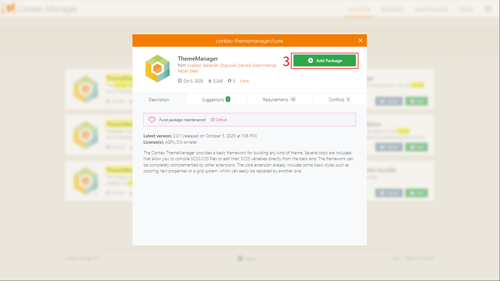

# Download und Installation

- [Contao](#installation-von-contao)
- [Installation](#installation-des-thememanagers)
  - [Kommandozeile](#über-kommandozeile)
  - [Contao Manager](#über-den-contao-manager)


## Installation von Contao

Für die Verwendung des Contao ThemeManagers ist das Contao CMS Voraussetzung.
Eine Installationsanleitung kann
[hier](https://docs.contao.org/manual/de/installation/quickstart/) gefunden werden.

## Installation des ThemeManagers

### Über Kommandozeile
Für die Installation über die Kommandozeile muss [Composer](https://getcomposer.org/) auf dem System installiert sein.

#### Paket installieren
```shell
composer require contao-thememanager/core 2.0
```

#### Datenbank migrieren
```shell
php vendor/bin/contao-console contao:migrate [options]
```


### Über den Contao Manager
Die Installation ist üblich wie die jeder anderen Erweiterung, welche über den Contao Manager zu finden
ist.

Der Contao Manager kann über ``example.com/contao-manager.phar.php`` aufgerufen werden,
``example.com`` muss hierbei  durch die eigene Domain ersetzt werden.

?> Hier findest Du [weitere Informationen über den Contao Manager](https://docs.contao.org/manual/de/installation/contao-manager/)


1. Der Contao ThemeManager lässt sich über die Suche durch die Eingabe von ``Contao ThemeManager`` finden.
____


2. Auf ``Details`` klicken, bis sich das Pop-up öffnet.
3. Paket zur Installation hinzufügen.
____

- Auf ``Änderung anwenden`` klicken, damit das Paket installiert wird.
____

- Nachdem die Installation durchgelaufen ist, muss die Datenbank aktualisiert werden, hierzu klickt man auf 
``Update Database``/``Datenbank aktualisieren``.
____

- Im letzten Schritt müssen die neuen Felder und Tabellen angelegt werden.
