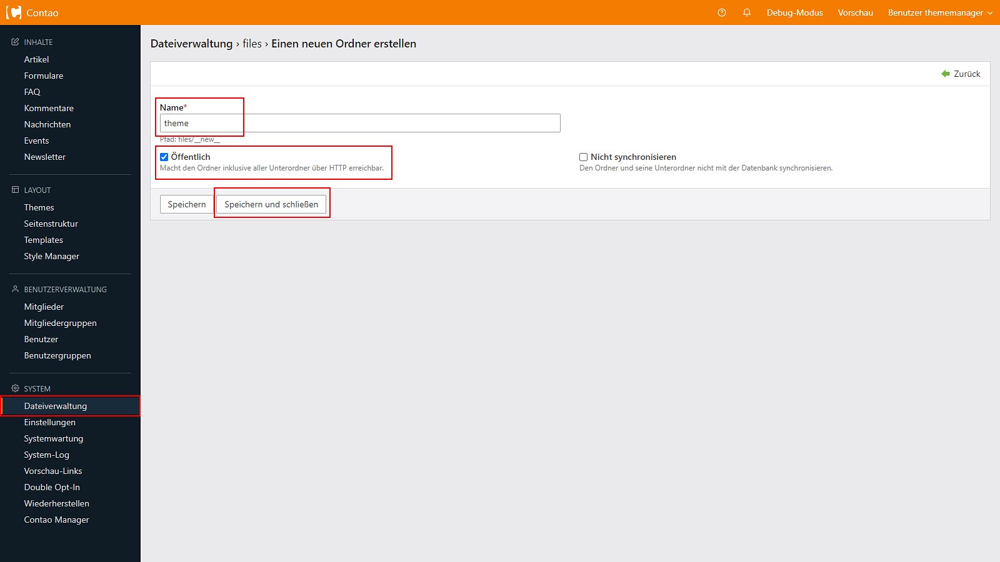
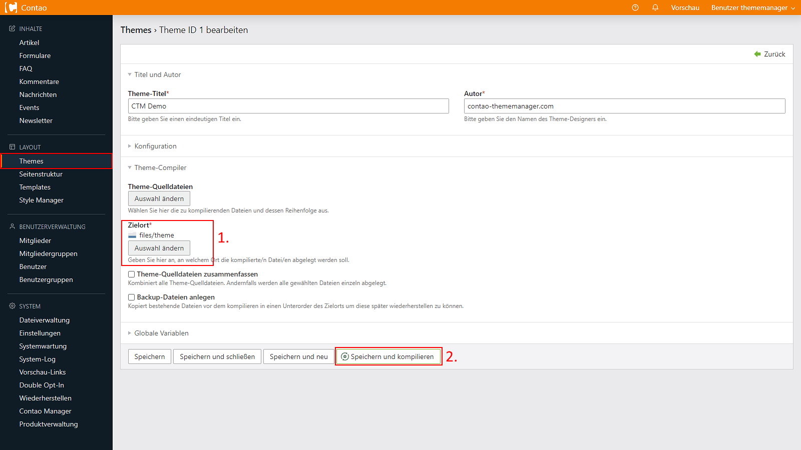
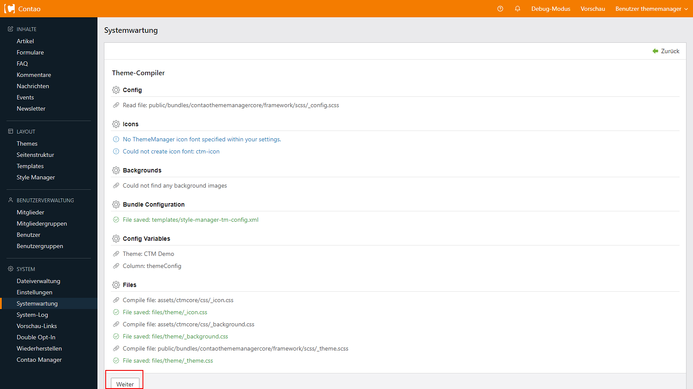
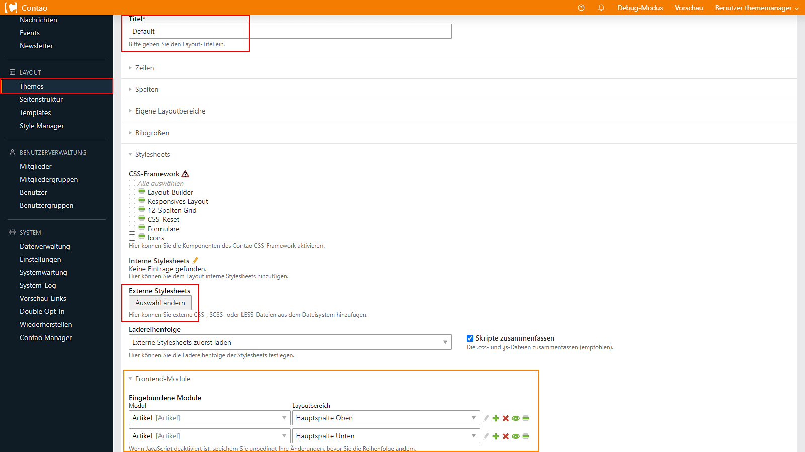
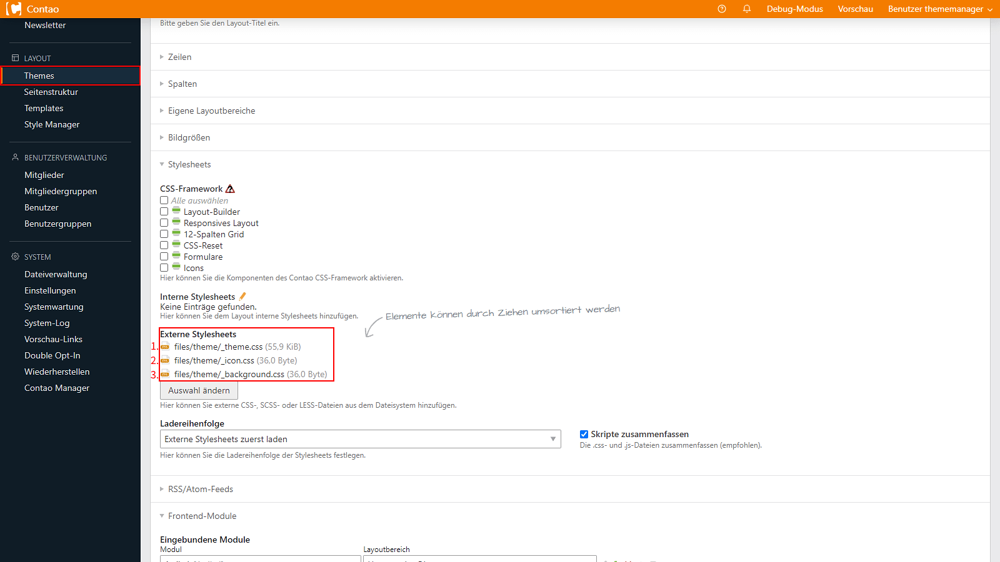
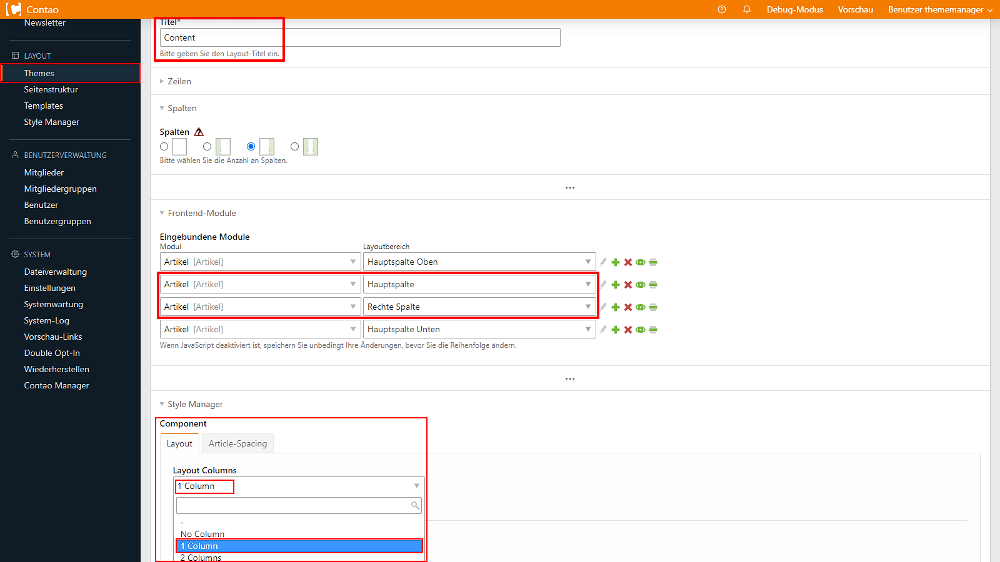
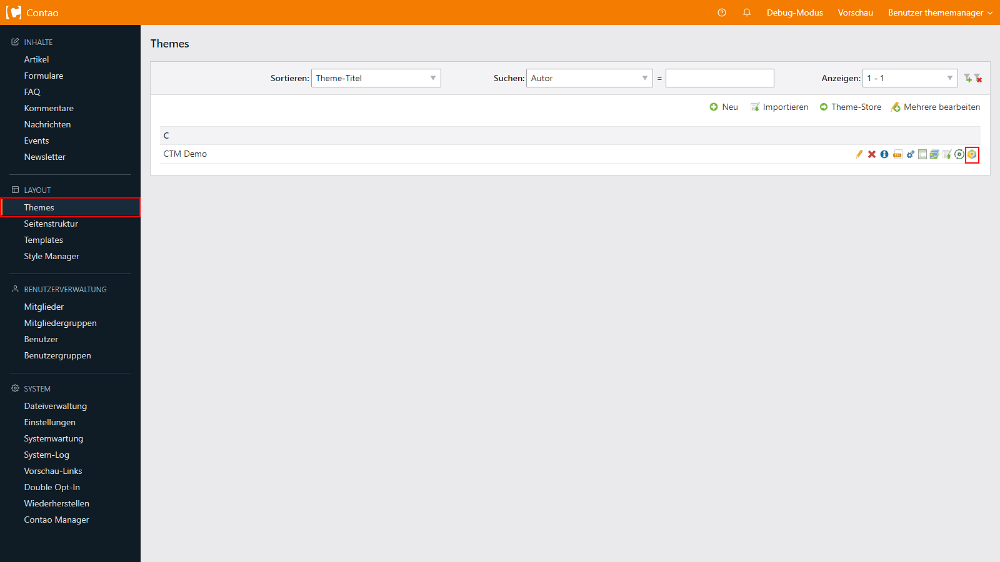
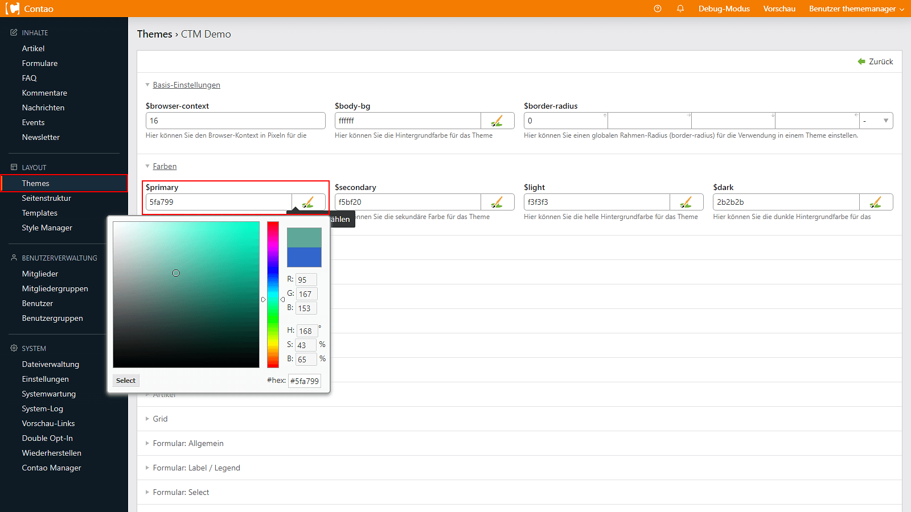
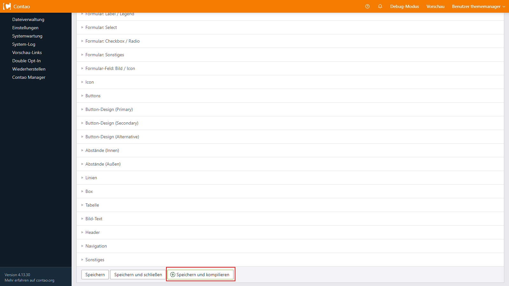

# Einrichtung
Der Contao ThemeManager bedient sich einer Vielzahl von Werkzeugen, sodass vor der eigentlichen Nutzung des Frameworks 
einige Schritte notwendig sind. Im Folgenden wird die Ersteinrichtung des Contao ThemeManagers Schritt für Schritt 
erklärt.

## Initiale Einrichtung
- [Ordner erstellen](#ordner-erstellen)
- [Theme erstellen](#theme-erstellen--einstellen)
- [Layout(s) erstellen](#layouts-erstellen)
  - [Standard-Layout](#layout-für-volle-breite)
  - [Inhalts-Layout](#inhaltslayout)
- [Theme-Konfiguration](#theme-konfiguration)

### Ordner erstellen
Beginne damit, in die Dateiverwaltung *(System/Dateiverwaltung)* von Contao zu navigieren und erstelle einen Ordner, in 
dem die Theme-Dateien deines erstellten Themes kompiliert werden sollen.

Stelle sicher, dass dieser Ordner öffentlich erreichbar ist.

### Theme erstellen / einstellen
Im nächsten Schritt legst du ein neues Theme *(Layout/Themes)* an. Du wirst feststellen, dass die Theme-Bearbeitung um 
eine neue Palette **Theme-Compiler** erweitert wurde.

?> Schau dir die offizielle [Contao-Dokumentation](https://docs.contao.org/manual/de/layout/theme-manager/themes-verwalten/) an, um zu erfahren, wie ein Theme in Contao eingerichtet wird.

Wähle den zuvor erstellten Ordner aus, in welchen die CSS-Dateien kompiliert werden sollen. Nach der Auswahl des 
Ordners kannst du durch **Speichern und kompilieren** die initialen Stylesheets
generieren.

#### Compiler-Report

Nach erfolgreichem Abschluss wirst du zum Compiler-Report weitergeleitet. Hier werden drei Dateien erstellt:

| Datei           | Funktion                                                                                                                                 |
|-----------------|------------------------------------------------------------------------------------------------------------------------------------------|
| _icon.css       | Beinhaltet das generierte Stylesheet der [Icons](configuration/icon-set), die über die Systemeinstellungen eingebunden wurden.           |
| _background.css | Beinhaltet das generierte Stylesheet der [Hintergrundbilder](configuration/backgrounds), die über die Dateiverwaltung festgelegt wurden. |
| _theme.css      | Enthält das [anpassbare Framework](configuration/theme) des Contao ThemeManagers.                                                        |

### Layout(s) erstellen
In diesem Abschnitt geht es um die Anpassung der Layouts, die für eine optimale Nutzung des ThemeManagers erforderlich 
sind. Das Contao ThemeManager Framework benötigt zwei neue Layoutbereiche, die standardmäßig bei der Layouterstellung 
eingestellt werden:

| Eigener Layoutbereich | ID          | Position                | Funktion                                                                                  |
|-----------------------|-------------|-------------------------|-------------------------------------------------------------------------------------------|
| Hauptspalte Oben      | main-above  | Unterhalb der Kopfzeile | Dient der Einbindung von bspw. Hero-Artikeln oberhalb des Inhalts-Bereiches.              |
| Hauptspalte Unten     | main-below  | Oberhalb der Fußzeile   | Dient der Einbindung von Artikeln, welche über die gesamte Bildschirmbreite gehen sollen. |                                               

?> Weitere Informationen zu Layouts findest du in der offiziellen 
[Contao-Dokumentation](https://docs.contao.org/manual/de/layout/theme-manager/seitenlayouts-verwalten/).

Mit Hilfe des ThemeManager Frameworks benötigen wir nicht mehr für jeden Zweck ein eigenes Layout. 
Wir empfehlen die Erstellung der folgenden zwei Layouts.

| Layout                                   | Beschreibung                                                      |
|------------------------------------------|-------------------------------------------------------------------|
| [Volle Breite](#layout-für-volle-breite) | Artikel mit voller Breite                                         |
| [Inhaltslayout](#inhaltslayout)          | Beinhaltet zusätzlich Artikel mit linker/rechter und Hauptspalte. |

#### Layout für volle Breite
Dieses Layout dient der Einbindung von Artikeln mit voller Breite und ignoriert die in Contao integrierten 
Layoutbereiche (Hauptspalte, Linke Spalte, Rechte Spalte). 

Im nachfolgenden Beispiel nennen wir es **Default**.

Bei der Erstellung eines neuen Layouts werden bereits folgende Einstellungen durch den ThemeManager vorgenommen:
- Zeilen *(Kopfzeile, Hauptzeile und Fußzeile)*
- Spalten *(Nur die Hauptspalte)*
- Eigene Layoutbereiche *(Hauptspalte Oben, Hauptspalte Unten)*
- Frontend-Module *(Einbindung der eigenen Layoutbereiche)*
- JavaScript *(JavaScript-Template: js_ctm_core -> Polyfills)*
- Experteneinstellungen *(Viewport-Tag)*

Du musst lediglich die im vorherigen Schritt generierten Stylesheets einbinden.

Binde nun unter **Externe Stylesheets** deine durch den [Compiler](#compiler-report) erstellten Stylesheets in folgender 
Reihenfolge ein:
1. _theme.css1
2. _icon.css
3. _background.css2

?> 1. Diese Reihenfolge dient lediglich der Best-Practice des Ladens von Stylesheet-Dateien beim Erstaufruf einer 
Website. Da sich innerhalb der ***_theme.css*** das Layout, Grid, Theme-Variablen und Default-Styles befinden, sollte 
diese Datei an erster Stelle eingebunden werden. In bestimmten Ausnahmen wie z.B. 
[FOUC](https://de.wikipedia.org/wiki/Flash_of_Unstyled_Content) oder 
[Above-The-Fold-CSS](https://web.dev/articles/extract-critical-css?hl=de), können kritische CSS-Dateien vor der 
***_theme.css*** eingebunden werden.  2. Es empfiehlt sich die _background.css in der Reihenfolge immer als 
letzte Stylesheet-Datei einzubinden, damit das Überschreiben dieser über einen eigenen [Skin](configuration/skin) 
einfacher ist.

#### Inhaltslayout
Dieses Layout bedient sich zusätzlich der in Contao integrierten Layoutbereiche: 
- Hauptspalte
- Linke Spalte
- Rechte Spalte

!> Die in der [Theme-Konfiguration](configuration/theme) zu findende Palette **Überschriften (Inhaltsbereich)** dient lediglich diesem Layout.

Um sicherzustellen, dass Artikel sowohl ober- als auch unterhalb des Hauptspaltenbereichs angezeigt werden können,
kannst du die folgenden Schritte befolgen.

Im nachfolgenden Beispiel nennen wir dieses Layout **Content**.

Dupliziere das zuvor erstellte [Layout](#layout-für-volle-breite) und passe die gewünschte Anzahl der Spalten an.

##### Layout-Columns
| Layout Columns | Funktion                                                                                                     |
|----------------|--------------------------------------------------------------------------------------------------------------|
| No Column      | Blendet den verantwortlichen Bereich ein, der für Hauptspalte, Linke Spalte und Rechte Spalte verwendet wird |
| 1 Column       | Richtet die Hauptspalte und ***eine*** linke oder rechte Spalte korrekt aus (eine Spalte)                    |
| 2 Columns      | Richtet die Hauptspalte und ***eine*** linke und rechte Spalte korrekt aus (zwei Spalten)                    |

In diesem Beispiel haben wir die Layoutbereiche **Hauptspalte** und **Reche Spalte** hinzugefügt, sodass diese jetzt 
**zwischen** den Layoutbereichen **Hauptspalte Oben** und **Hauptspalte Unten** eingebunden werden müssen.

Die StyleManager-Einstellung der [Layout-Columns](#layout-columns) hängt dabei von der genutzten Anzahl der Spalten ab.

?> Der horizontale und vertikale Abstand dieser Layoutbereiche lassen sich über das Article-Spacing im Layout einstellen.

### Theme-Konfiguration
Das CSS-Framework des Contao ThemeManagers kann an die eigenen Bedürfnisse angepasst werden.
Dies umfasst beispielsweise Farben, Typografie, Überschriften, Formulare, Buttons, Tabellen, Layout-Einstellungen, das 
Grid, die Breakpoint-Einstellungen und vieles mehr.

Die Theme-Konfiguration lässt sich nun über die Theme-Übersicht mithilfe des 
 **Theme konfigurieren**-Buttons aufrufen.

*Änderung der primären Farbe*

*Speichern und Kompilieren des Themes.*

Im nächsten Abschnitt [Theme konfigurieren](configuration/theme) erfährst du im Detail, welche Optionen in der 
Theme-Konfiguration verfügbar sind und wie sie das Aussehen und Verhalten deines Themes beeinflussen.
